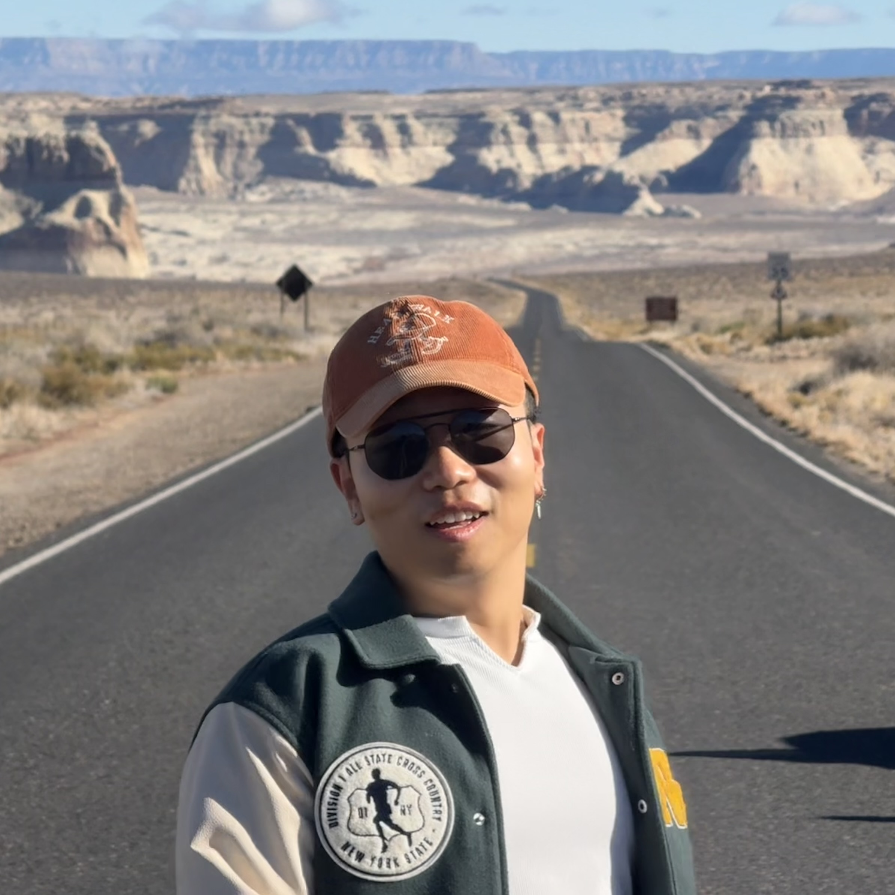
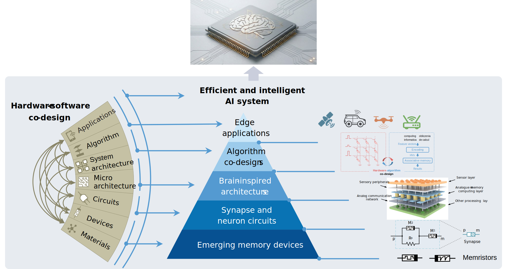
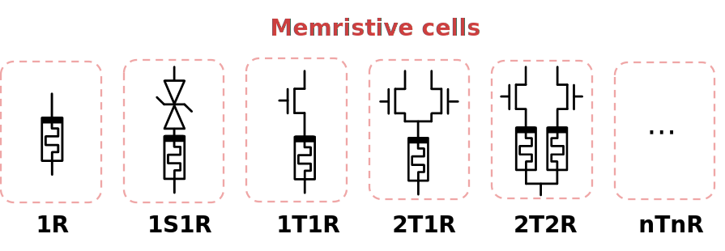
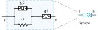
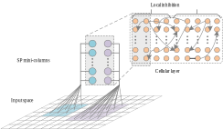
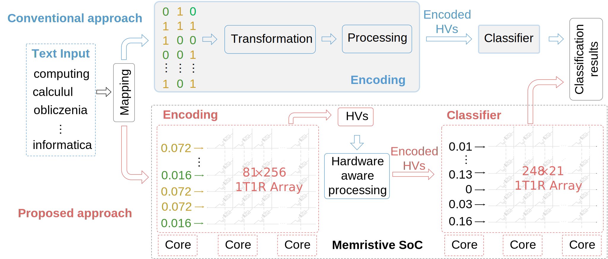
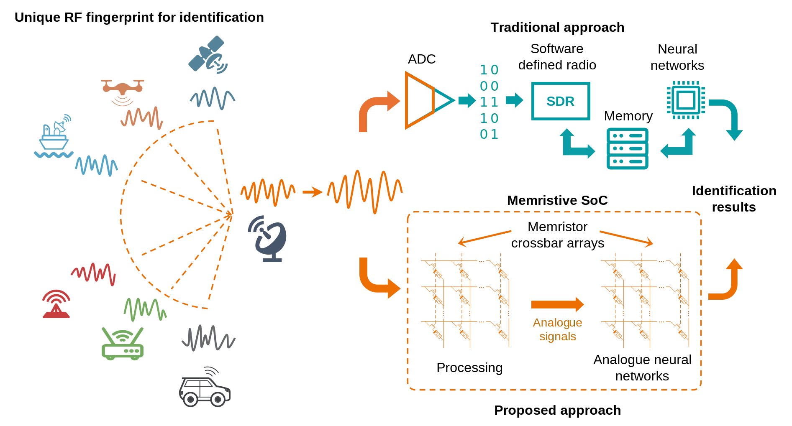
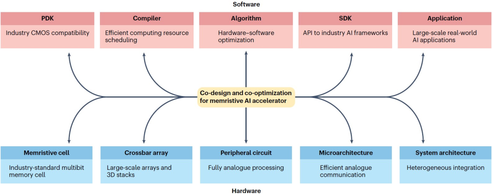

---
lang: zh
title-block: false
---

::: {.home-page}

::: {.intro-block}
::: {.intro-row}
::: {.intro-left}
{fig-alt="Yi Huang 个人照片" width="100%" fig-align="left"}
:::

::: {.intro-right}
**即将入职助理教授**\
[Min H. Kao 电气工程与计算机科学系](https://eecs.utk.edu/)\
[Tickle 工程学院](https://tickle.utk.edu/)\
[基础人工智能集群](https://research.utk.edu/cluster-hire/foundational-artificial-intelligence/)\
[田纳西大学诺克斯维尔分校](https://www.utk.edu/)
:::

::: {.intro-extra}
电子邮件: [yihuang\@utk.edu](mailto:yihuang@utk.edu)

地址: 1520 Middle Drive, Knoxville, TN 37996-2250

[Google Scholar](https://scholar.google.com/citations?user=Y0JqxgwAAAAJ&hl=en) &bull; [ORCID](https://orcid.org/0000-0001-9628-1721) &bull; [LinkedIn](https://www.linkedin.com/in/yi-huang-b046a91aa/?skipRedirect=true)
:::
:::
:::

## 研究愿景

### 挑战：人工智能与人类智能之间的鸿沟
人工智能（AI）已成为日常生活的一部分，为语音助手、医疗诊断等应用提供动力。但这种进步伴随着难以持续的数据与能源规模化成本。AI 与人类智能之间仍存在巨大鸿沟，尤其体现在能效上：支撑 AI 的数据中心耗电量堪比小型城市，而人脑只需一餐的能量即可运作；也体现在认知能力上：AI 需要海量数据才能学习的任务，人类却能在有限经验下掌握。

### 目标：人类水平的能效与认知能力
我们的研究愿景是通过软硬件协同设计范式缩小这一差距，该范式跨越电气工程与计算机科学（EECS）的多个层级，并汲取认知神经科学的灵感。最终目标是实现接近人脑的能效与认知能力，从而在广泛应用中赋能下一代 AI 系统。

  
  <a class="svg-ref svg-ref-1" href="publications.zh.html#ref-Ye2023" data-ref-id="ref-Ye2023" aria-label="参考文献：Ye2023">[...]</a>
  <a class="svg-ref svg-ref-2" href="publications.zh.html#ref-Yang2020" data-ref-id="ref-Yang2020" aria-label="参考文献：Yang2020">[...]</a>
  <a class="svg-ref svg-ref-3" href="publications.zh.html#ref-Shi2018a" data-ref-id="ref-Shi2018a" aria-label="参考文献：Shi2018a">[...]</a>
  <a class="svg-ref svg-ref-4" href="publications.zh.html#ref-Yang2018b" data-ref-id="ref-Yang2018b" aria-label="参考文献：Yang2018b">[...]</a>
  <a class="svg-ref svg-ref-5" href="publications.zh.html#ref-Nowshin2024" data-ref-id="ref-Nowshin2024" aria-label="参考文献：Nowshin2024">[...]</a>
  <a class="svg-ref svg-ref-6" href="publications.zh.html#ref-Liu2022" data-ref-id="ref-Liu2022" aria-label="参考文献：Liu2022">[...]</a>
  <a class="svg-ref svg-ref-7" href="publications.zh.html#ref-Huang2018a" data-ref-id="ref-Huang2018a" aria-label="参考文献：Huang2018a">[...]</a>
  <a class="svg-ref svg-ref-8" href="publications.zh.html#ref-Ravichandran2026" data-ref-id="ref-Ravichandran2026" aria-label="参考文献：Ravichandran2026">[...]</a>
  <a class="svg-ref svg-ref-9" href="publications.zh.html#ref-Jiang2025" data-ref-id="ref-Jiang2025" aria-label="参考文献：Jiang2025">[...]</a>
  <a class="svg-ref svg-ref-10" href="publications.zh.html#ref-huang2024hardware" data-ref-id="ref-huang2024hardware" aria-label="参考文献：Huang2024hardware">[...]</a>
  <a class="svg-ref svg-ref-11" href="publications.zh.html#ref-Zhao2026" data-ref-id="ref-Zhao2026" aria-label="参考文献：Zhao2026">[...]</a>
  <a class="svg-ref svg-ref-12" href="publications.zh.html#ref-Huang2025" data-ref-id="ref-Huang2025" aria-label="参考文献：Huang2025">[...]</a>
  <a class="svg-ref svg-ref-13" href="publications.zh.html#ref-Huang2024" data-ref-id="ref-Huang2024" aria-label="参考文献：Huang2024">[...]</a>
  <a class="svg-ref svg-ref-14" href="publications.zh.html#ref-Huang2023_APL" data-ref-id="ref-Huang2023_APL" aria-label="参考文献：Huang2023_APL">[...]</a>
  <a class="svg-ref svg-ref-15" href="publications.zh.html#ref-Huang2023_Nano" data-ref-id="ref-Huang2023_Nano" aria-label="参考文献：Huang2023_Nano">[...]</a>

### 方法：跨层协同设计框架
我们通过受人脑启发、并构建在新型存储器件基础上的模拟存内计算（AIMC）系统来实现这一愿景。该方法模拟了生物神经系统的工作机理：数据在存储位置直接处理，消除了传统架构中 CPU 与存储器分离带来的开销；计算也直接在模拟信号上进行，而非依赖离散的数字数据表示。

基于我们已有的工作（见上图），该方法以跨层协同设计框架为核心，覆盖器件、电路、架构、算法与应用等层级：

::: {.h4-card-grid}

::: {.h4-card}

新型存储器器件

我们建模各类新型存储器器件，包括非易失与易失忆阻器，为 AIMC 硬件奠定物理基础，并利用其丰富的模拟动态特性。

::: {.h4-image-placeholder}
{fig-alt="器件图"}
:::
:::

::: {.h4-card}

突触与神经元电路

我们设计模拟与混合信号电路，利用器件级动态特性来模拟生物突触与神经元的随机性与时序行为。

::: {.h4-image-placeholder}
{fig-alt="电路图"}
:::
:::

::: {.h4-card}

脑启发架构

我们开发层次化、分布式架构，实现模拟与数字域之间的高效片上通信，从而支持多层信息处理与高度并行计算。

::: {.h4-image-placeholder}
{fig-alt="架构图"}
:::
:::

::: {.h4-card}

算法协同设计

我们协同设计神经网络结构与片上学习算法，以适配脑启发硬件基底，融入脉冲、事件驱动与模拟特性，实现实时片上学习。

::: {.h4-image-placeholder}
{fig-alt="算法图"}
:::
:::

::: {.h4-card}

边缘应用

我们将这些高能效、低时延系统集成到传感器、可穿戴与移动设备中，满足广泛边缘应用对即时智能决策与低功耗的需求。

::: {.h4-image-placeholder}
{fig-alt="应用图"}
:::
:::

::: {.h4-card}

高能效 AI 系统

我们通过连接 AIMC 硬件、脑启发架构与算法，构建高能效智能 AI 系统，并利用软硬件协同设计支撑下一代 AI。

::: {.h4-image-placeholder}
{fig-alt="系统图"}
:::
:::

:::

:::
