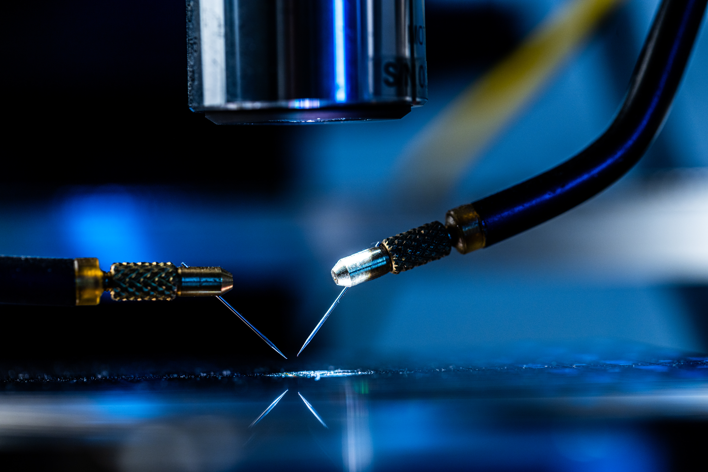
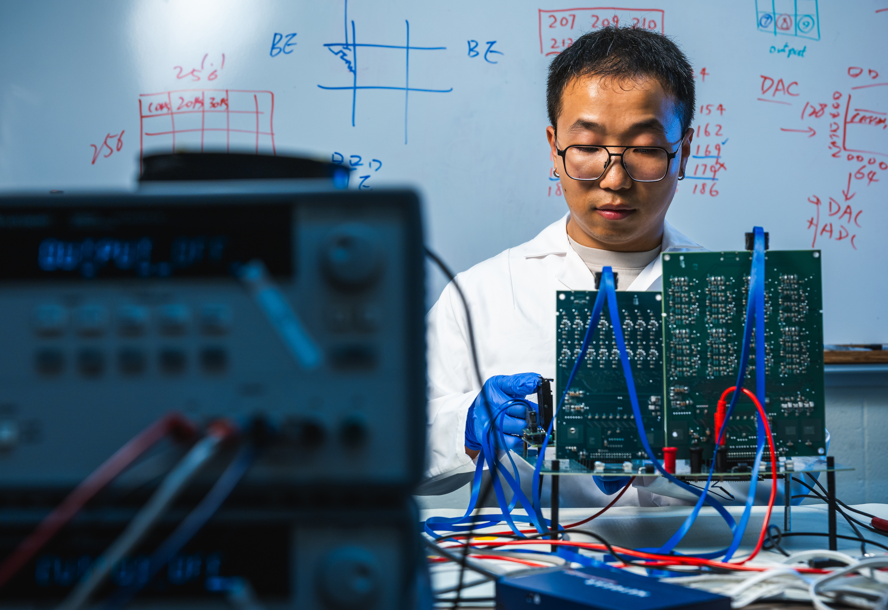
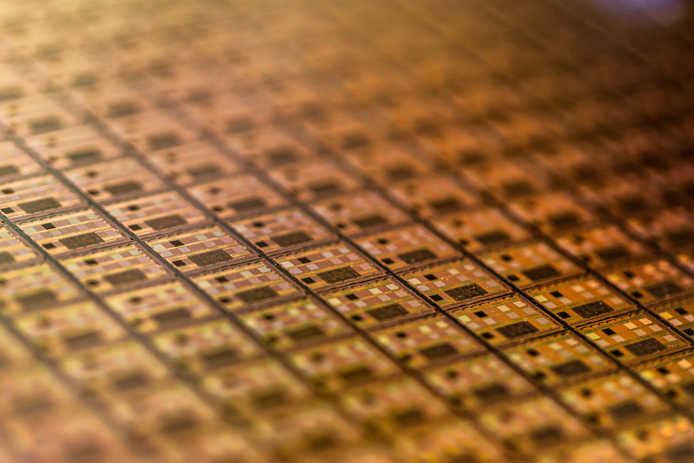
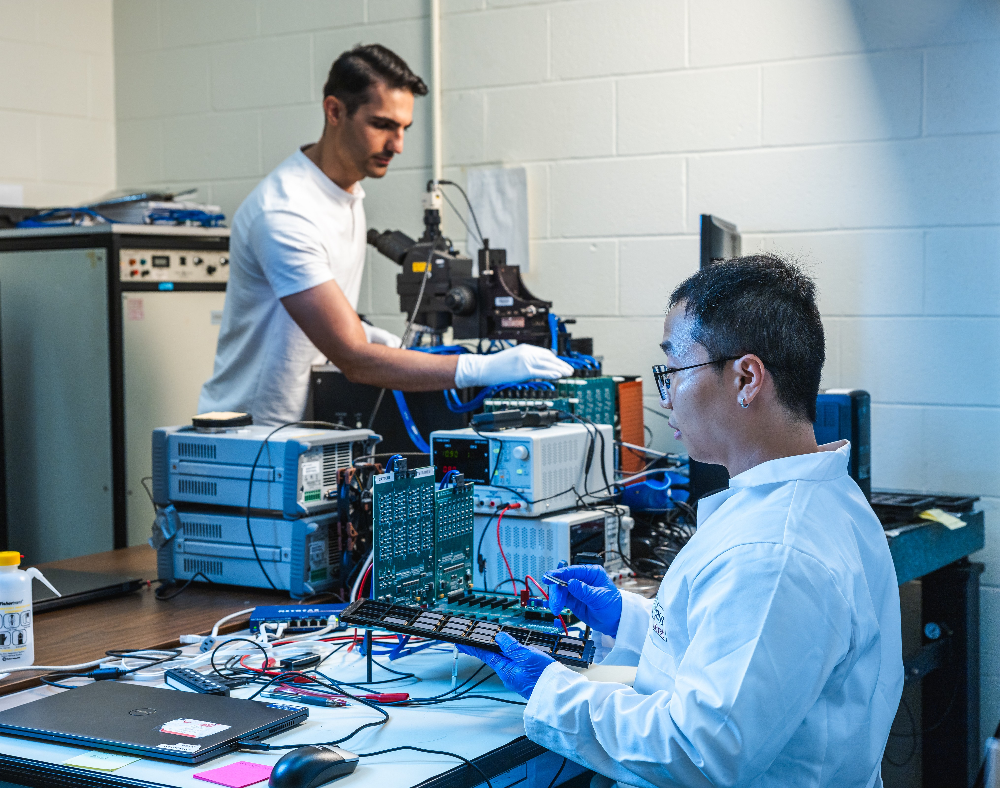

```{=html}
<div class="photo-page">
  <div class="photo-carousel" data-photo-carousel>
    <div class="photo-viewport">
      <div class="photo-track">
        <figure class="photo-card">
          
        </figure>

        <figure class="photo-card">
          
        </figure>

        <figure class="photo-card">
          
        </figure>

        <figure class="photo-card">
          
        </figure>

        <figure class="photo-card">
          
        </figure>

      </div>
    </div>

    <button class="photo-nav photo-nav-prev" type="button" aria-label="Previous photo">&lsaquo;</button>
    <button class="photo-nav photo-nav-next" type="button" aria-label="Next photo">&rsaquo;</button>

    <div class="photo-dots" aria-label="Photo navigation"></div>
  </div>
</div>

<script>
document.addEventListener("DOMContentLoaded", () => {
  document.querySelectorAll("[data-photo-carousel]").forEach((carousel) => {
    const viewport = carousel.querySelector(".photo-viewport");
    const track = carousel.querySelector(".photo-track");
    const slides = Array.from(carousel.querySelectorAll(".photo-card"));
    const prev = carousel.querySelector(".photo-nav-prev");
    const next = carousel.querySelector(".photo-nav-next");
    const dotsWrap = carousel.querySelector(".photo-dots");
    let index = 0;
    let autoplayTimer = null;

    if (!viewport || !track || slides.length === 0 || !dotsWrap) return;

    const dots = slides.map((_, slideIndex) => {
      const dot = document.createElement("button");
      dot.type = "button";
      dot.className = "photo-dot";
      dot.setAttribute("aria-label", `Show photo ${slideIndex + 1}`);
      dot.addEventListener("click", () => goTo(slideIndex, true));
      dotsWrap.appendChild(dot);
      return dot;
    });

    function updateHeight() {
      const activeImage = slides[index]?.querySelector("img");
      if (!activeImage) return;
      const applyHeight = () => {
        viewport.style.height = `${activeImage.getBoundingClientRect().height}px`;
      };
      if (activeImage.complete) {
        applyHeight();
      } else {
        activeImage.addEventListener("load", applyHeight, { once: true });
      }
    }

    function goTo(nextIndex, manual = false) {
      index = (nextIndex + slides.length) % slides.length;
      const slide = slides[index];
      const offset = slide.offsetLeft - (viewport.clientWidth - slide.clientWidth) / 2;
      track.style.transform = `translateX(${-offset}px)`;
      dots.forEach((dot, dotIndex) => {
        dot.classList.toggle("is-active", dotIndex === index);
      });
      updateHeight();
      if (manual) scheduleAutoplay();
    }

    function scheduleAutoplay() {
      window.clearTimeout(autoplayTimer);
      autoplayTimer = window.setTimeout(() => {
        goTo(index + 1);
        scheduleAutoplay();
      }, 3000);
    }

    prev?.addEventListener("click", () => goTo(index - 1, true));
    next?.addEventListener("click", () => goTo(index + 1, true));
    window.addEventListener("resize", () => goTo(index));
    goTo(0);
    scheduleAutoplay();
  });
});
</script>
```
