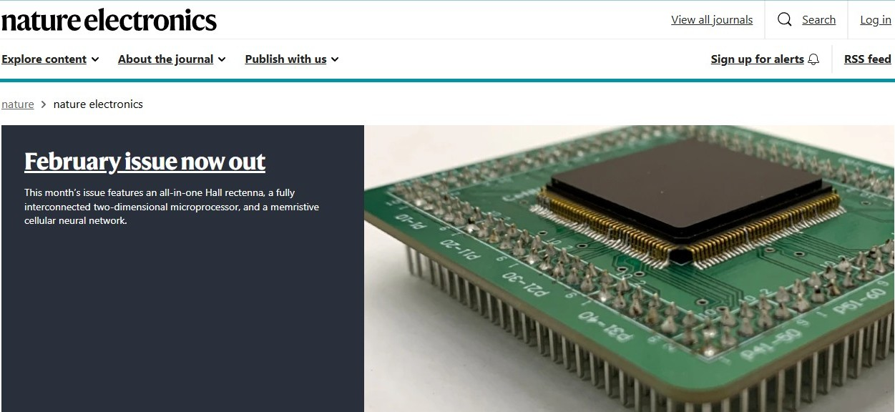

---
title: "Research Highlights"
---

::: {.image-grid}
::: {.image-box}
<figure class="image-figure">
  
  <figcaption>
    
Memristive SoC for signal processing

    
<a href="https://www.nature.com/natelectron/volumes/8/issues/7">_Nature Electronics_ (Cover article, July 2025)</a>

  </figcaption>
</figure>
:::

::: {.image-box}
<figure class="image-figure">
  
  <figcaption>
    
CMOS-based cellular neural network

    
<a href="https://www.nature.com/articles/s41928-025-01559-z">_Nature Electronics_ (Website banner and editorial)</a>

  </figcaption>
</figure>
:::

::: {.image-box}
<figure class="image-figure">
  
  <figcaption>
    
Neuromorphic sensing system

    
<a href="https://www.nature.com/articles/s44460-025-00025-9"> _Nature Sensors_ (Reported in News & Views)</a>

  </figcaption>
</figure>
:::

::: {.image-box}
<figure class="image-figure">
  
  <figcaption>
    
Memristor-based hardware accelerators for AI

    
<a href="https://www.nature.com/articles/s44287-024-00037-6">_Nature Reviews Electrical Engineering_ (Invited review)</a>

  </figcaption>
</figure>
:::
