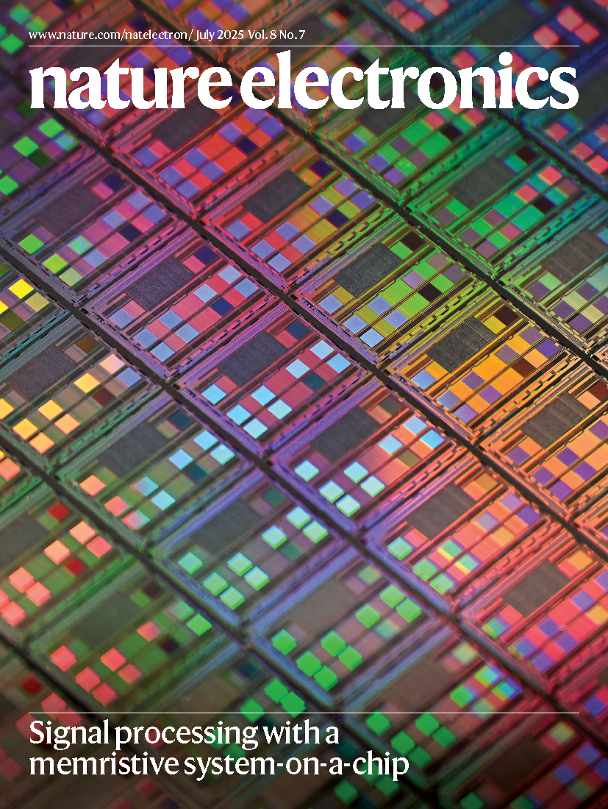
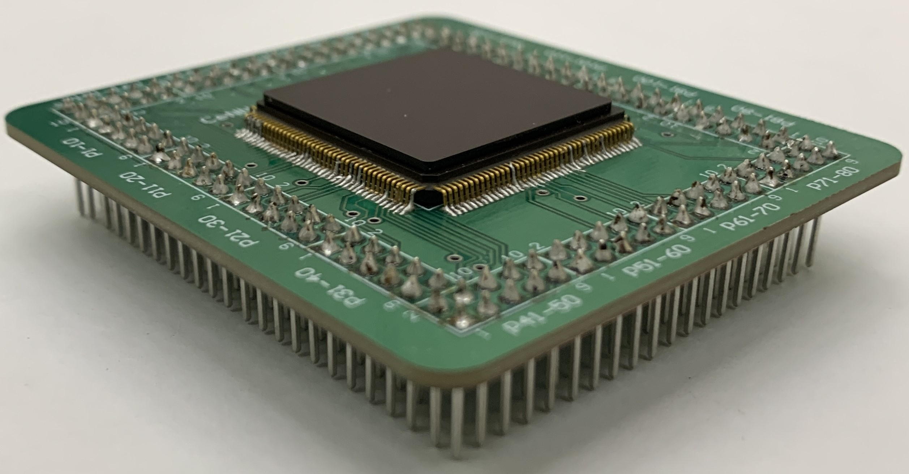
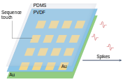
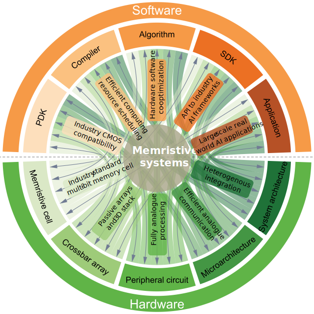

---
title: "研究亮点"
lang: zh
---

::: {.image-grid}
::: {.image-box}
<figure class="image-figure">
  
  <figcaption><a href="https://communities.springernature.com/posts/memristive-system-on-a-chip-for-intelligent-wireless-communications"> 忆阻器片上系统（SoC） </a></figcaption>
</figure>
:::

::: {.image-box}
<figure class="image-figure">
  
  <figcaption><a href="https://www.nature.com/articles/s41928-025-01559-z"> CMOS 细胞神经网络 </a></figcaption>
</figure>
:::

::: {.image-box}
<figure class="image-figure">
  
  <figcaption><a href="https://www.nature.com/articles/s44460-025-00025-9"> 类脑感知系统 </a></figcaption>
</figure>
:::

::: {.image-box}
<figure class="image-figure">
  
  <figcaption><a href="https://www.nature.com/articles/s44287-024-00037-6"> 忆阻器 AI 加速器 </a></figcaption>
</figure>
:::
